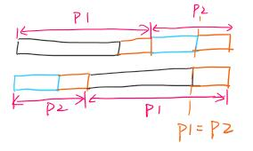

# 两个链表的第一个公共结点

[链接](https://www.nowcoder.com/practice/6ab1d9a29e88450685099d45c9e31e46) 

首先，最直接的想法就是双重循环；但是题目要求时间复杂度为n  

所以双重循环不行。

想不出来，参考题解。如图所示  


>使用两个指针N1,N2，一个从链表1的头节点开始遍历，我们记为N1，一个从链表2的头节点开始遍历，我们记为N2。
>
>让N1和N2一起遍历，当N1先走完链表1的尽头（为null）的时候，则从链表2的头节点继续遍历，同样，如果N2先走完了链表2的尽头，则从链表1的头节点继续遍历，也就是说，N1和N2都会遍历链表1和链表2。  
>
>因为两个指针，同样的速度，走完同样长度（链表1+链表2），不管两条链表有无相同节点，都能够到达同时到达终点。  
>
>（N1最后肯定能到达链表2的终点，N2肯定能到达链表1的终点）。  
>
>所以，如何得到公共节点：
>
>- 有公共节点的时候，N1和N2必会相遇，因为长度一样嘛，速度也一定，必会走到相同的地方的，所以当两者相等的时候，则会第一个公共的节点
>- 无公共节点的时候，此时N1和N2则都会走到终点，那么他们此时都是null，所以也算是相等了。

```c
/**
 * struct ListNode {
 *	int val;
 *	struct ListNode *next;
 * };
 *
 * C语言声明定义全局变量请加上static，防止重复定义
 *
 * C语言声明定义全局变量请加上static，防止重复定义
 */

/**
 * 
 * @param pHead1 ListNode类 
 * @param pHead2 ListNode类 
 * @return ListNode类
 */
struct ListNode* FindFirstCommonNode(struct ListNode* pHead1, struct ListNode* pHead2 ) {
    // write code here
    
    struct ListNode* p1 = pHead1; 
    struct ListNode* p2 = pHead2; 
    
    while(p1 != p2){
        if(p1 == NULL) p1 = pHead2;
        else p1=p1->next; 
        
        if(p2 == NULL) p2 = pHead1;
        else p2=p2->next; 
    }
    
    return p1; 
}
```
