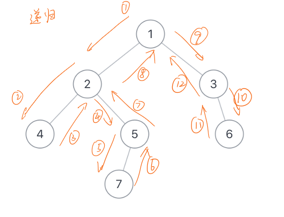

# JZ55 二叉树的深度

输入一棵二叉树，求该树的深度。从根结点到叶结点依次经过的结点（含根、叶结点）形成树的一条路径，最长路径的长度为树的深度，根节点的深度视为 1 。

递归；

```c
/**
 * struct TreeNode {
 *	int val;
 *	struct TreeNode *left;
 *	struct TreeNode *right;
 * };
 *
 * C语言声明定义全局变量请加上static，防止重复定义
 */
/**
 * 代码中的类名、方法名、参数名已经指定，请勿修改，直接返回方法规定的值即可
 *
 * 
 * @param pRoot TreeNode类 
 * @return int整型
 */
int TreeDepth(struct TreeNode* pRoot ) {
    // write code here
    
    // if root node is empty, return 0
    if(pRoot == NULL) return 0; 
    
    int depth;
    int left_depth = TreeDepth(pRoot->left);
    int right_depth = TreeDepth(pRoot->right);
    depth = left_depth > right_depth ? (left_depth+1) : (right_depth+1);
    return depth;
}
```

图解  
  


